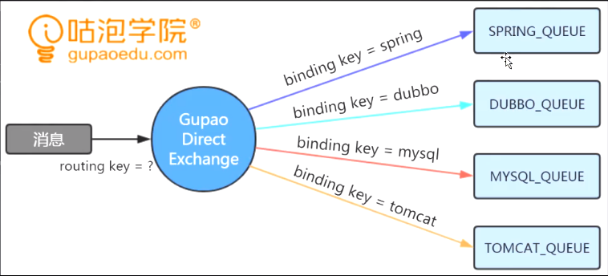
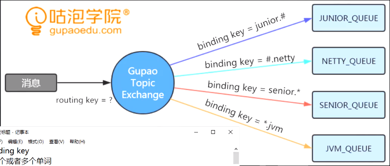

# RabbitMQ 学习笔记

> 消息队列的优点: `实现异步`, `系统解耦`, `流量削峰`

> 发布订阅模式, 广播通讯, 实现AMQP协议, 消息队列本质是解决通讯问题


## 安装 erlang
---
> rabbit-mq 是使用 erlang 语言开发的, 因此需要先安装 erlang 环境, 再安装 rabbit-mq, erlang 的安装一般有多种方式, 在此 **推荐第 4 种方式** 安装, 本文在阿里云 CentOS 7.3 系统中安装

### 1. 从源文件手动编译安装
需要下载[源文件](http://www.erlang.org/downloads), 然后安装编译环境, 编译, 安装, 设置环境变量, 过于复杂麻烦在此不进行记录说明
### 2. 直接用包管理工具安装
使用包管理工具里提供好的 预编译二进制文件 直接安装, **但是** 这个版本可能比较保守, 当你装新版的 rabbit-mq 时可能会发现安装不了
```
yum install erlang
```
* For Homebrew on OS X: brew install erlang

* For MacPorts on OS X: port install erlang

* For Ubuntu and Debian: apt-get install erlang

* For Fedora: yum install erlang

* For FreeBSD: pkg install erlang

### 3. 下载预编译文件安装
使用 [ErlangSolutions](https://www.erlang-solutions.com/resources/download.html) 提供的预编译好的二进制文件, **但是** rabbit-mq 在安装的时候可能依旧会提示你erlang版本不符合, 如默认yum仓库中的版本较低
* 下载 erlang OTP 21.3 版本
```
wget https://packages.erlang-solutions.com/erlang/esl-erlang/FLAVOUR_1_general/esl-erlang_21.3.3-1~centos~7_amd64.rpm
```
* 安装 预编译好的二进制文件
```
yum install esl-erlang_21.3.3-1~centos~7_amd64.rpm 
```
### 4. 使用rabbit-mq提供的erlang包安装
> CentOS7 可使用如下方式安装, 其它版本linux可参考其官方[erlang-rpm 项目](https://github.com/rabbitmq/erlang-rpm)
```
vi /etc/yum.repos.d/rabbitmq_erlang.repo
```

``` bash
# 以下内容粘贴在 /etc/yum.repos.d/rabbitmq_erlang.repo 文件中
[rabbitmq_erlang]
name=rabbitmq_erlang
baseurl=https://packagecloud.io/rabbitmq/erlang/el/7/$basearch
repo_gpgcheck=1
gpgcheck=0
enabled=1
gpgkey=https://packagecloud.io/rabbitmq/erlang/gpgkey
sslverify=1
sslcacert=/etc/pki/tls/certs/ca-bundle.crt
metadata_expire=300

[rabbitmq_erlang-source]
name=rabbitmq_erlang-source
baseurl=https://packagecloud.io/rabbitmq/erlang/el/7/SRPMS
repo_gpgcheck=1
gpgcheck=0
enabled=1
gpgkey=https://packagecloud.io/rabbitmq/erlang/gpgkey
sslverify=1
sslcacert=/etc/pki/tls/certs/ca-bundle.crt
metadata_expire=300
```
* 安装 erlang,  之后一路 y 即可
```
yum install erlang
```

## 安装 rabbit-mq
---
* 下载 v3.7.14 编译好的二进制文件, 也可选择其它版本进行[下载](https://github.com/rabbitmq/rabbitmq-server/releases)
```
wget https://github.com/rabbitmq/rabbitmq-server/releases/download/v3.7.14/rabbitmq-server-3.7.14-1.el7.noarch.rpm
```
* 安装 预编译好的二进制文件
```
yum install rabbitmq-server-3.7.14-1.el7.noarch.rpm 
```

## rabbit-mq 命令
---
### 启动
```
service rabbitmq-server start
```
### 停止
```
service rabbitmq-server stop
```
### 查看状态
```
service rabbitmq-server status
```

### 启用Web端管理插件
```
rabbitmq-plugins enable rabbitmq_management
```

### 添加用户 setsuna
```
rabbitmqctl add_user setsuna password 
```

### 修改角色
> 一般建议在设置了管理员角色后, 到Web管理平台删除 guest 账户
```
rabbitmqctl set_user_tags setsuna administrator
```

### 修改权限
> 赋予用户 对 virtual hosts : / 的所有权限, 可在Web管理平台更方便的设置
```
rabbitmqctl set_permissions -p / setsuna '.*' '.*' '.*'
```

## rabbit-mq 卸载
### 卸载 erlang
* 如果是下载预编译二进制文件手动安装的, 可通过如下方式卸载
```
yum remove esl-erlang.x86_64
```
* 如果使用 `yum install erlang` 安装的 erlang 可能需要如下方式卸载干净
```
yum list installed | grep erlang
yum -y remove erlang-*
yum remove erlang.x86_64
rm -rf /usr/lib64/erlang
```

### 卸载 rabbit-mq
```
service rabbitmq-server stop
yum list installed | grep rabbit
yum -y remove rabbitmq-server.noarch
rm -rf /var/lib/rabbitmq
```

## rabbit-mq 角色
---
### none 
> 不能访问 Web端管理平台, 一般的消费者和生产者使用此角色

### management
> 用户可以通过 AMQP 做的任何事外加：
> * 列出自己可以通过AMQP登入的 virtual hosts  
> * 查看自己的 virtualhosts 中的 queues, exchanges 和 bindings
> * 查看和关闭自己的 channels 和 connections
> * 查看有关自己的 virtual hosts 的“全局”的统计信息，包含其他用户在这些 virtual hosts 中的活动。

### policymaker 
> management 可以做的任何事外加：
> * 查看、创建和删除自己的 virtualhosts 所属的 policies 和 parameters

### monitoring
> management 可以做的任何事外加：
> * 列出所有 virtualhosts，包括他们不能登录的 virtualhosts
> * 查看其他用户的 connections 和 channels
> * 查看节点级别的数据如 clustering 和 memory 使用情况
> * 查看真正的关于所有 virtualhosts 的全局的统计信息

### administrator   
> policymaker 和 monitoring 可以做的任何事外加:
> * 创建和删除 virtualhosts
> * 查看、创建和删除 users
> * 查看创建和删除 permissions
> * 关闭其他用户的 connections

## rabbit-mq 配置
---
> 一般来说默认的配置文件路径如下 /etc/rabbitmq/rabbitmq.config 默认没有这个文件, 需自己创建, 更多信息可查看官网的 [配置说明](https://www.rabbitmq.com/configure.html)
```
vi /etc/rabbitmq/rabbitmq.config
```

### 修改服务的默认端口号
```
[
  {rabbit, [
      {tcp_listeners, [5673]}
    ]
  }
].
```

## rabbit-mq 理解
---
### 概念理解


* Exchange：消息交换机，指定消息按什么规则，路由到哪个队列。

* Queue：消息队列，每个消息都会被投入到一个或者多个队列里, 独立运行的进程, 有自己的数据库存储消息, 先进先出。

* Binding：绑定，它的作用是把 exchange 和 queue 按照路由规则 binding 起来。

* Routing Key：路由关键字，exchange根据这个关键字进行消息投递。

* Virtual Host: 虚拟主机，一个broker里可以开设多个vhost，用作不用用户的权限分离。每个virtual host本质上都是一个RabbitMQ Server（但是一个server中可以有多个virtual host），拥有它自己若干的个Exchange、Queue和bings rule等等。其实这是一个虚拟概念，类似于权限控制组。Virtual Host是权限控制的最小粒度, 提高硬件应用率, 资源隔离(不同虚拟机下可定义同名交换机, 同名队列), 安装时会提供默认虚拟机:`/`。

* Producer：消息生产者，就是投递消息的程序。

* Consumer：消息消费者，就是接受消息的程序。

* Connection: 就是一个TCP的连接。Producer和Consumer都是通过TCP连接到RabbitMQ Server的。接下来的实践案例中我们就可以看到，producer和consumer与exchange的通信的前提是先建立TCP连接。仅仅创建了TCP连接，producer和consumer与exchange还是不能通信的。我们还需要为每一个Connection创建Channel。

* Channel: 消息信道, 它是建立在上述TCP连接之上的虚拟连接。数据传输都是在Channel中进行的。AMQP协议规定只有通过Channel才能执行AMQP的命令。一个Connection可以包含多个Channel。有人要问了，为什么要使用Channel呢，直接用TCP连接不就好了么？对于一个消息服务器来说，它的任务是处理海量的消息，当有很多线程需要从RabbitMQ中消费消息或者生产消息，那么必须建立很多个connection，也就是许多个TCP连接。然而对于操作系统而言，建立和关闭TCP连接是非常昂贵的开销，而且TCP的连接数也有限制，频繁的建立关闭TCP连接对于系统的性能有很大的影响，如果遇到高峰，性能瓶颈也随之显现。RabbitMQ采用类似NIO的做法，选择TCP连接复用，不仅可以减少性能开销，同时也便于管理。在TCP连接中建立Channel是没有上述代价的，可以复用TCP连接。对于Producer或者Consumer来说，可以并发的使用多个Channel进行Publish或者Receive。有实验表明，在Channel中，1秒可以Publish10K的数据包。对于普通的Consumer或者Producer来说，这已经足够了。除非有非常大的流量时，一个connection可能会产生性能瓶颈，此时就需要开辟多个connection。


### 交换机说明

#### 直连类型交换机(DIRECT_EXCHANGE): 

* binging key(精确的绑定关键字) 
* routing key(路由关键字)

#### 主题类型交换机(TOPIC_EXCHANGE): 

* binging key(匹配的绑定关键字): `#` 匹配0个或者多个单词  `*` 匹配一个单词
* routing key(路由关键字)

#### 广播类型的交换机(FANOUT_EXCHANGE): 
* 无需绑定关键字和路由关键字, 发送消息时所有关联的队列都会收到

#### 头类型交换机 HEADERS_EXCHANGE
类似主题交换机，但是头交换机使用多个消息属性来代替路由键建立路由规则。通过判断消息头的值能否与指定的绑定相匹配来确立路由规则。 
此交换机有个重要参数：”x-match”

当”x-match”为“any”时，消息头的任意一个值被匹配就可以满足条件
当”x-match”设置为“all”的时候，就需要消息头的所有值都匹配成功

## rabbit-mq 在 spring-boot 中使用
---
### Maven 依赖
```
<dependency>
    <groupId>org.springframework.boot</groupId>
    <artifactId>spring-boot-starter-amqp</artifactId>
</dependency>
```
### [配置文件说明](https://github.com/spring-projects/spring-boot/blob/v1.5.2.RELEASE/spring-boot-autoconfigure/src/main/java/org/springframework/boot/autoconfigure/amqp/RabbitProperties.java)

配置项|中文说明|默认值
-|-|-
spring.rabbitmq.address	| 客户端连接的地址，有多个的时候使用逗号分隔，该地址可以是IP与Port的结合 | 
spring.rabbitmq.cache.channel.checkout-timeout | 当缓存已满时，获取Channel的等待时间，单位为毫秒 | 
spring.rabbitmq.cache.channel.size | 缓存中保持的Channel数量 | 
spring.rabbitmq.cache.connection.mode | 连接缓存的模式 | CHANNEL
spring.rabbitmq.cache.connection.size | 缓存的连接数 | 
spring.rabbitmq.connnection-timeout | 连接超时参数单位为毫秒：设置为“0”代表无穷大 | 
spring.rabbitmq.dynamic | 默认创建一个AmqpAdmin的Bean | true
spring.rabbitmq.host | RabbitMQ的主机地址 | localhost
spring.rabbitmq.listener.acknowledge-mode | 容器的acknowledge模式 | 
spring.rabbitmq.listener.auto-startup | 启动时自动启动容器 | true
spring.rabbitmq.listener.concurrency | 消费者的最小数量 | 
spring.rabbitmq.listener.default-requeue-rejected | 投递失败时是否重新排队 | true
spring.rabbitmq.listener.max-concurrency | 消费者的最大数量 | 
spring.rabbitmq.listener.prefetch | 在单个请求中处理的消息个数，他应该大于等于事务数量 | 
spring.rabbitmq.listener.retry.enabled | 不论是不是重试的发布 | false
spring.rabbitmq.listener.retry.initial-interval | 第一次与第二次投递尝试的时间间隔 | 1000
spring.rabbitmq.listener.retry.max-attempts | 尝试投递消息的最大数量 | 3
spring.rabbitmq.listener.retry.max-interval | 两次尝试的最大时间间隔 | 10000
spring.rabbitmq.listener.retry.multiplier | 上一次尝试时间间隔的乘数 | 1.0
spring.rabbitmq.listener.retry.stateless | 不论重试是有状态的还是无状态的 | true
spring.rabbitmq.listener.transaction-size | 在一个事务中处理的消息数量。为了获得最佳效果，该值应设置为小于等于每个请求中处理的消息个数，即spring.rabbitmq.listener.prefetch的值 | 
spring.rabbitmq.password | 登录到RabbitMQ的密码 | 
spring.rabbitmq.port | RabbitMQ的端口号 | 5672
spring.rabbitmq.publisher-confirms | 开启Publisher Confirm机制 | false
spring.rabbitmq.publisher-returns | 开启publisher Return机制 | false
spring.rabbitmq.requested-heartbeat | 请求心跳超时时间，单位为秒 | 
spring.rabbitmq.ssl.enabled | 启用SSL支持 | false
spring.rabbitmq.ssl.key-store | 保存SSL证书的地址 | 
spring.rabbitmq.ssl.key-store-password | 访问SSL证书的地址使用的密码 | 
spring.rabbitmq.ssl.trust-store | SSL的可信地址 | 
spring.rabbitmq.ssl.trust-store-password | 访问SSL的可信地址的密码 | 
spring.rabbitmq.ssl.algorithm | SSL算法，默认使用Rabbit的客户端算法库 | 
spring.rabbitmq.template.mandatory | 启用强制信息 | false
spring.rabbitmq.template.receive-timeout | receive()方法的超时时间 | 0
spring.rabbitmq.template.reply-timeout | sendAndReceive()方法的超时时间 | 5000
spring.rabbitmq.template.retry.enabled | 设置为true的时候RabbitTemplate能够实现重试 | false
spring.rabbitmq.template.retry.initial-interval | 第一次与第二次发布消息的时间间隔 | 1000
spring.rabbitmq.template.retry.max-attempts | 尝试发布消息的最大数量 | 3
spring.rabbitmq.template.retry.max-interval | 尝试发布消息的最大时间间隔 | 10000
spring.rabbitmq.template.retry.multiplier | 上一次尝试时间间隔的乘数 | 1.0
spring.rabbitmq.username | 登录到RabbitMQ的用户名 |  
spring.rabbitmq.virtual-host | 连接到RabbitMQ的虚拟主机 | 

* 英文原版说明
``` java
spring.rabbitmq.addresses= // Comma-separated list of addresses to which the client should connect.
spring.rabbitmq.cache.channel.checkout-timeout= // Number of milliseconds to wait to obtain a channel if the cache size has been reached.
spring.rabbitmq.cache.channel.size= // Number of channels to retain in the cache.
spring.rabbitmq.cache.connection.mode=channel // Connection factory cache mode.
spring.rabbitmq.cache.connection.size= // Number of connections to cache.
spring.rabbitmq.connection-timeout= // Connection timeout, in milliseconds; zero for infinite.
spring.rabbitmq.dynamic=true // Create an AmqpAdmin bean.
spring.rabbitmq.host=localhost // RabbitMQ host.
spring.rabbitmq.listener.acknowledge-mode= // Acknowledge mode of container.
spring.rabbitmq.listener.auto-startup=true // Start the container automatically on startup.
spring.rabbitmq.listener.concurrency= // Minimum number of consumers.
spring.rabbitmq.listener.default-requeue-rejected= // Whether or not to requeue delivery failures; default `true`.
spring.rabbitmq.listener.idle-event-interval= // How often idle container events should be published in milliseconds.
spring.rabbitmq.listener.max-concurrency= // Maximum number of consumers.
spring.rabbitmq.listener.prefetch= // Number of messages to be handled in a single request. It should be greater than or equal to the transaction size (if used).
spring.rabbitmq.listener.retry.enabled=false // Whether or not publishing retries are enabled.
spring.rabbitmq.listener.retry.initial-interval=1000 // Interval between the first and second attempt to deliver a message.
spring.rabbitmq.listener.retry.max-attempts=3 // Maximum number of attempts to deliver a message.
spring.rabbitmq.listener.retry.max-interval=10000 // Maximum interval between attempts.
spring.rabbitmq.listener.retry.multiplier=1.0 // A multiplier to apply to the previous delivery retry interval.
spring.rabbitmq.listener.retry.stateless=true // Whether or not retry is stateless or stateful.
spring.rabbitmq.listener.transaction-size= // Number of messages to be processed in a transaction. For best results it should be less than or equal to the prefetch count.
spring.rabbitmq.password= // Login to authenticate against the broker.
spring.rabbitmq.port=5672 // RabbitMQ port.
spring.rabbitmq.publisher-confirms=false // Enable publisher confirms.
spring.rabbitmq.publisher-returns=false // Enable publisher returns.
spring.rabbitmq.requested-heartbeat= // Requested heartbeat timeout, in seconds; zero for none.
spring.rabbitmq.ssl.enabled=false // Enable SSL support.
spring.rabbitmq.ssl.key-store= // Path to the key store that holds the SSL certificate.
spring.rabbitmq.ssl.key-store-password= // Password used to access the key store.
spring.rabbitmq.ssl.trust-store= // Trust store that holds SSL certificates.
spring.rabbitmq.ssl.trust-store-password= // Password used to access the trust store.
spring.rabbitmq.ssl.algorithm= // SSL algorithm to use. By default configure by the rabbit client library.
spring.rabbitmq.template.mandatory=false // Enable mandatory messages.
spring.rabbitmq.template.receive-timeout=0 // Timeout for `receive()` methods.
spring.rabbitmq.template.reply-timeout=5000 // Timeout for `sendAndReceive()` methods.
spring.rabbitmq.template.retry.enabled=false // Set to true to enable retries in the `RabbitTemplate`.
spring.rabbitmq.template.retry.initial-interval=1000 // Interval between the first and second attempt to publish a message.
spring.rabbitmq.template.retry.max-attempts=3 // Maximum number of attempts to publish a message.
spring.rabbitmq.template.retry.max-interval=10000 // Maximum number of attempts to publish a message.
spring.rabbitmq.template.retry.multiplier=1.0 // A multiplier to apply to the previous publishing retry interval.
spring.rabbitmq.username= // Login user to authenticate to the broker.
spring.rabbitmq.virtual-host= // Virtual host to use when connecting to the broker.
```

### 配置类
#### 创建交换机
#### 创建队列
#### 创建绑定关系


### 生产者
AmqpTemplate:
    convertAndSend(exchange, routingKey, content)

### 消费者


## rabbit-mq 消息可靠性投递
---
### 确保消息成功发送到 rabbit-mq 服务器

#### 事务模式
```
try {
    txSelect
    txPublish
    txCommit
} catch (e) {
    txRollback
}
```

#### 确认模式
* 简单确认模式
* 批量确认模式
* 异步确认模式

### 确保消息路由到正确的队列
转发给自己 ReturnListener
指定交换机的备份交换机

### 确保信息在队列正确的存储
#### 队列持久化
#### 交换机持久化
#### 消息持久化

### 确保 rabbit-mq 高可用
集群

### 确保消息从队列正确的投递到消费者
---
#### 自动ACK
消费者接收到消息时就立即返回ACK, 无论业务方法是否执行完
#### 手动ACK
```
try {

} finally {
    // 以防消息在队列里堆积
    channel.basicAck();
}
```

### 生产者怎么知道消费者是否正确消费了消息
#### 消费者回调
* 生产者发送消息时提供回调接口, 消费者接收到消息处理后调用回调API
* 消费者接收到消息后发送应达消息
#### 补偿机制
* 消息重发(重发消息是否与原消息一致? 控制次数(计数器)? 根据流水日志进行对照)
#### 消息幂等性
* 消费者处理消息时的逻辑具有幂等性(流水号 bizId 唯一的) 处理前根据bizId查重